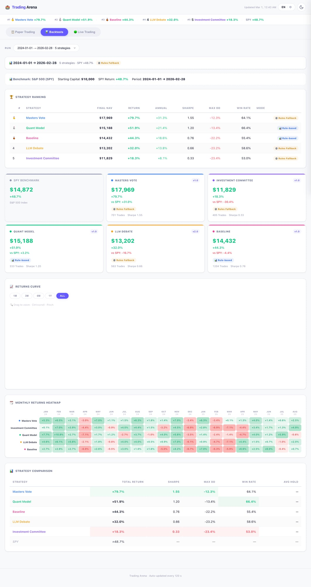
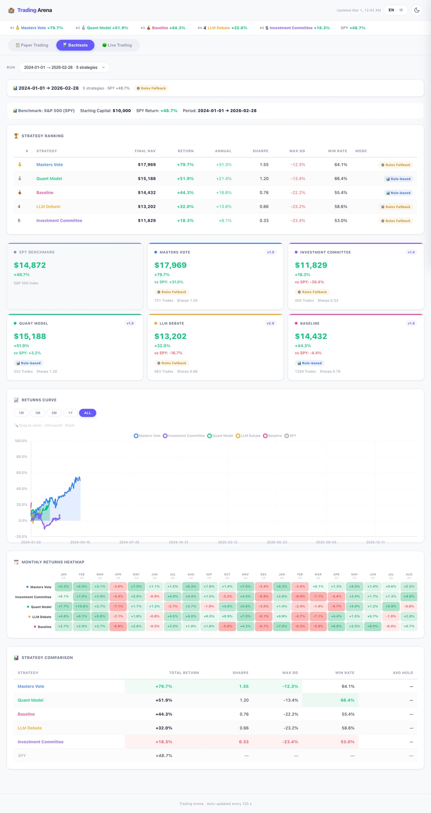

<p align="center">
  
</p>

<h1 align="center">🏟️ Trading Arena Dashboard</h1>

<p align="center">
  <strong>5 AI trading strategies compete head-to-head on S&P 500 stocks.</strong><br>
  <em>Who wins — the quant, the AI debate team, or Warren Buffett's ghost?</em>
</p>

<p align="center">
  <a href="https://zw-g.github.io/trading-arena-dashboard/">
    
  </a>
</p>

<p align="center">
  
  
  
  
  
</p>

---

## 📸 Preview

<details open>
<summary><strong>☀️ Light Mode</strong></summary>
<br>
<p align="center">
  
</p>
</details>

<details>
<summary><strong>🌙 Dark Mode</strong></summary>
<br>
<p align="center">
  
</p>
</details>

---

## 🤔 What Is This?

Trading Arena is an **AI strategy competition platform** where 5 different trading strategies independently manage virtual $10,000 portfolios across S&P 500 stocks — then we see who comes out on top.

Think of it as **AI gladiator combat, but with stock picks instead of swords.** ⚔️

### The 5 Strategies

| # | Strategy | Approach | Brain |
|---|----------|----------|-------|
| 🥇 | **Masters Vote** | 4 legendary investors (Graham, Wood, Druckenmiller, Burry) vote on each stock | AI (Claude) |
| 🏛️ | **Investment Committee** | 3-role pipeline: Research Analyst → Risk Manager → Portfolio Manager | AI (Claude) |
| 📊 | **Quant Model** | Technical indicators (MACD, RSI, Stochastic) + VIX regime detection | Rule-based |
| 🤖 | **LLM Debate** | Bull vs Bear AI agents argue, then a Judge decides | AI (Claude) |
| 📈 | **Baseline** | Simple MA200 crossover with tiered confidence | Rule-based |

All strategies are benchmarked against the **S&P 500 (SPY)**.

---

## ✨ Dashboard Features

- **📊 Strategy Leaderboard** — Real-time rankings with medals and performance metrics
- **📈 Returns Curve** — Interactive Chart.js with zoom, pan, and time range filters
- **🗓️ Monthly Heatmap** — Color-coded monthly returns across all strategies
- **🏆 Strategy Cards** — At-a-glance NAV, return, Sharpe ratio, and trade count
- **📋 Strategy Comparison** — Side-by-side table with best/worst highlighting
- **🔍 Trade Explorer** — Virtual-scrolling list of 2,500+ individual trades with search & filter
- **📱 Fully Responsive** — Mobile bottom nav, card carousel, touch-optimized
- **🌗 Dark Mode** — Auto-detects system preference, manual toggle available
- **🌐 i18n** — English & Chinese language support

---

## 🏗️ Architecture

```
┌─────────────────────────────────────────┐
│           Static Dashboard              │
│  ┌─────┐ ┌─────┐ ┌─────┐ ┌──────────┐  │
│  │HTML │ │CSS  │ │ JS  │ │ JSON Data│  │
│  │Shell│ │5 mod│ │5 mod│ │(exported)│  │
│  └─────┘ └─────┘ └─────┘ └──────────┘  │
│         GitHub Pages (free)             │
└─────────────┬───────────────────────────┘
              │ auto-deploy on push
              │ (GitHub Actions)
┌─────────────┴───────────────────────────┐
│        Trading Arena Engine             │
│  (Private repo — strategies, runner,    │
│   backtester, data pipeline)            │
└─────────────────────────────────────────┘
```

- **Zero backend** — Pure static HTML/CSS/JS, hosted free on GitHub Pages
- **Chart.js 4.4.7** — Charts with zoom plugin, LTTB decimation
- **Modular CSS** — Variables, base, components, charts, responsive (5 files)
- **Modular JS** — Config, data, UI, charts, app (5 files)
- **Auto-deploy** — Push to `main` → live in ~30 seconds

---

## 🚀 Quick Start

Just visit the live dashboard:

**👉 [zw-g.github.io/trading-arena-dashboard](https://zw-g.github.io/trading-arena-dashboard/)**

No installation needed. It's a static website.

### Run Locally

```bash
git clone https://github.com/zw-g/trading-arena-dashboard.git
cd trading-arena-dashboard
# Any static server works:
python3 -m http.server 8080
# → http://localhost:8080
```

---

## 📊 Current Results (Backtest: Jan 2024 → Feb 2026)

| Strategy | Final NAV | Return | vs SPY | Sharpe |
|----------|-----------|--------|--------|--------|
| 🥇 Masters Vote | $17,969 | +79.7% | +31.0% | 1.55 |
| 🥈 Quant Model | $15,188 | +51.9% | +3.2% | 1.20 |
| 🥉 Baseline | $14,432 | +44.3% | -4.4% | 0.76 |
| 4️⃣ LLM Debate | $13,202 | +32.0% | -16.7% | 0.66 |
| 5️⃣ Investment Committee | $11,829 | +18.3% | -30.4% | 0.33 |
| 📌 SPY Benchmark | $14,872 | +48.7% | — | — |

> ⚠️ **Backtest results ≠ future performance.** These strategies are experimental and for educational purposes only.

---

## 🛠️ Tech Stack

| Layer | Tech |
|-------|------|
| Frontend | HTML5, CSS3, Vanilla JS |
| Charts | [Chart.js](https://www.chartjs.org/) 4.4.7 + Zoom Plugin |
| Hosting | GitHub Pages (free) |
| CI/CD | GitHub Actions (auto-deploy) |
| Data | Static JSON (exported from engine) |

---

## 📄 License

This dashboard is open source. The trading engine (strategies, AI prompts, backtester) lives in a separate private repository.

---

<p align="center">
  <sub>Built with 🍑 by <a href="https://github.com/zw-g">@zw-g</a> and an AI that thinks it can beat the market</sub>
</p>
